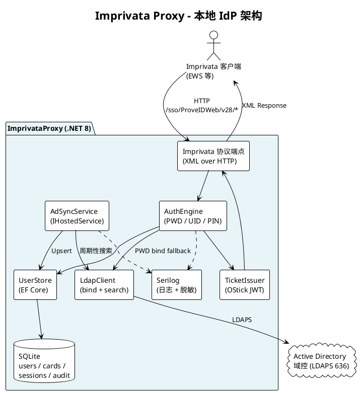
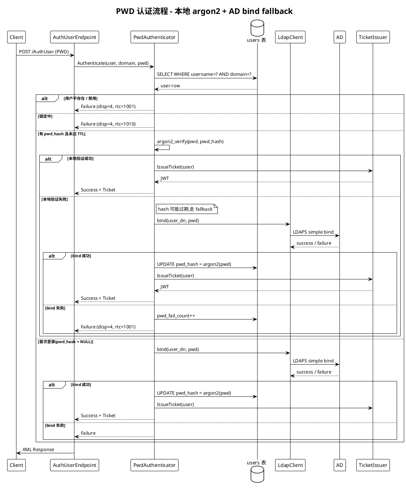
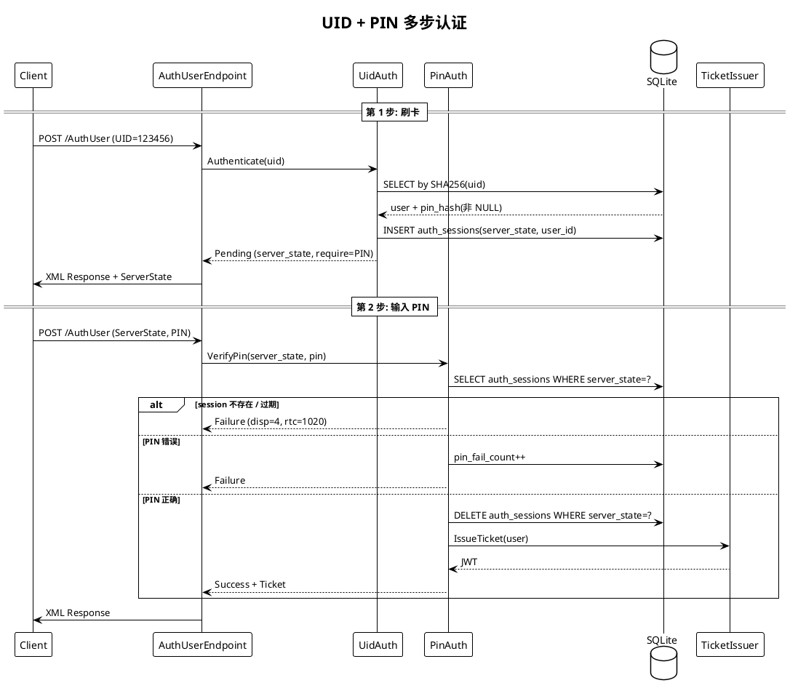

# ImprivataProxy 设计文档 - 本地 IdP + AD 同步

## 1. 概述

### 1.1 目标

设计并实现一个**本地身份提供者(Local IdP)服务**,对外暴露 Imprivata ProveID Web API 兼容的协议,让现有 Imprivata 客户端(EWS 等)无感知地接入。后端身份源是 **Active Directory**,代理自己维护账户库与卡号 / PIN,不再需要真实 Imprivata 服务器。

核心价值:

1. **Imprivata 协议兼容** — 客户端代码不改,只改服务器地址
2. **本地账户 + AD 映射** — 复刻 Imprivata 自身的"独立账户库 + AD mapping"架构
3. **AD 作为真相源** — 用户元数据和密码验证能力都从 AD 来,但代理自己管卡号 / PIN
4. **密码修改透明化** — 密码修改交给 AD,代理的本地 argon2 哈希通过 LDAP bind 透明刷新
5. **无上游依赖** — 不依赖真实 Imprivata 服务器,代理就是后端

### 1.2 与旧版本的区别

本版本**取代了**原先的 YARP 反向代理 + SAML 富化设计。主要差异:

| 维度 | 旧版本(YARP Proxy) | 本版本(Local IdP) |
|------|--------------------|-------------------|
| 角色 | 反向代理,透传到 Imprivata | Imprivata 协议仿真器,无上游 |
| 身份源 | SAML IdP(ADFS/Azure AD) | Active Directory(LDAPS) |
| 密码验证 | Imprivata 服务器做 | 代理本地 argon2 + AD LDAP bind fallback |
| 账户存储 | 无(Imprivata 管) | 代理本地 SQLite |
| 卡号 / PIN | Imprivata 管 | 代理本地管 |
| 核心库 | YARP + ITfoxtec SAML | EF Core + System.DirectoryServices.Protocols |
| Ticket | 透传 Imprivata OStick | 代理自签 JWT (OStick scheme) |

> 📘 架构收敛的详细权衡、SAML 为何装不下刷卡/PIN 场景、以及未来可能切回 SAML 的扩展口,见决策记录 **[ADR-0001: AD LDAP 同步 vs SAML](./adr-0001-adsync-vs-saml.md)**。
>
> 📗 把 Imprivata ProveID Web API 当作 IdP 看,代理采用 **Facade / Core / Source 三层架构**(可插拔协议前端 + 协议无关认证核心 + 可替换身份源),见决策记录 **[ADR-0002: IdP 架构范式](./adr-0002-idp-architecture.md)**。
>
> 📙 **架构演进(2026-05-04 起)**:在 ADR-0002 基础上完成 11 次后续 commit(§5 目录规整 + §8.1-§8.4 反模式全部消除 + §4.1 契约 11/13 达标 + Phase γ ArchUnit CI 保护 + IdpCore 去 AD 化),本文档下文的目录/接口细节(如 "`EfAuditLogger`"、"`ILdapClient.BindAsUserAsync`" 等)**已过时**;最新架构状态卡片 + 每次推进的 commit hash 见 **[ADR-0002 §附录 B](./adr-0002-idp-architecture.md)** 和 **[实施记录](./adr-0002-phase-ab-implementation.md)**。业务层面的**认证场景 / AD 同步策略 / 数据模型**(§1.4 - §6 主体)不变,仍以本文档为准。

### 1.3 Imprivata ProveID Web API 特征

基于 `7_ProveIDWebAPI_Developer's_Reference.pdf` (v7.2 SP1):

| 特征 | 说明 |
|------|------|
| URL 格式 | `/sso/ProveIDWeb/v{version}/{Resource}`(当前使用 v28) |
| 数据格式 | XML (`text/xml`), UTF-8 编码 |
| 必需 Headers | `isx-product`(厂商 ProductID),`isx-client`(客户端信息) |
| 认证方案 | `Authorization: OStick ostick.ticket=<ticket>` |
| 多步认证 | 通过 `ServerState` 不透明字符串维护状态 |
| 认证方式(Imprivata 支持) | PWD(密码), UID(门禁卡), FP(指纹), PIN, PKI(证书), KRB(Kerberos), QnA, OTP |
| **本项目支持的场景** | **PWD only, UID only, UID + PIN 三种** |

### 1.4 支持的认证场景

代理**仅实现以下三种 Imprivata 认证场景**,其他(FP, PKI, KRB, QnA, OTP)不在范围内。

#### 场景 1: PWD only(仅密码认证)

单步请求,客户端直接提供用户名+域+密码:

```xml
POST /sso/ProveIDWeb/v28/AuthUser
<Request>
  <ModalityAuthInput modalityID="PWD">
    <AuthRequest>
      <PasswordVerificationRequest>
        <UserIdentity>
          <Username>alice</Username>
          <Domain>CORP</Domain>
        </UserIdentity>
        <Password>xxx</Password>
      </PasswordVerificationRequest>
    </AuthRequest>
  </ModalityAuthInput>
  <CreateAuthTicket>true</CreateAuthTicket>
</Request>
```

**代理动作**:
- 查本地 `users` 表(按 username + domain)
- 优先用本地 `pwd_hash` (argon2id) 验证
- 本地哈希不存在 / 过期 / 不匹配 → 向 AD 做 LDAP simple bind
- bind 成功 → 重算 argon2 写回 `pwd_hash`(透明缓存)
- 签 JWT OStick Ticket 返回

#### 场景 2: UID only(仅门禁卡认证)

单步请求,客户端刷卡后发送卡号:

```xml
POST /sso/ProveIDWeb/v28/AuthUser
<Request>
  <ModalityAuthInput modalityID="UID">
    <AuthRequest>
      <UniqueID>123456789</UniqueID>
    </AuthRequest>
  </ModalityAuthInput>
  <CreateAuthTicket>true</CreateAuthTicket>
</Request>
```

**代理动作**:
- 对 UID 做 SHA-256 后查 `user_cards` 表
- 找到对应 user 且该 user 不要求 PIN → 直接签 Ticket
- 找到对应 user 但配置要求 PIN → 返回 `ServerState` 进入多步流程(场景 3)
- 日志中 `UniqueID` 自动脱敏

#### 场景 3: UID + PIN(门禁卡 + PIN 组合,多步认证)

**步骤 1** — 客户端先发送 UID(同场景 2)

**步骤 1 响应** — 代理返回 `ServerState` 和 PIN 挑战:

```xml
<Response>
  <ServerState>a1b2c3d4</ServerState>
  <AuthState disp="1" rtc="2" />
  <ModalityAuthOutput modalityID="UID" disp="0" />
  <RemainingAuthPolicy>
    <AuthPolicyOption>
      <AuthPolicyItem modalityID="PIN" />
    </AuthPolicyOption>
  </RemainingAuthPolicy>
</Response>
```

**步骤 2** — 客户端发送 PIN + `ServerState`:

```xml
POST /sso/ProveIDWeb/v28/AuthUser
<Request>
  <ServerState>a1b2c3d4</ServerState>
  <ModalityAuthInput modalityID="PIN">
    <AuthRequest>
      <PIN>1234</PIN>
    </AuthRequest>
  </ModalityAuthInput>
</Request>
```

**代理动作**:
- `ServerState` 指向本地 `auth_sessions` 表(60s TTL)
- argon2 验证 PIN,失败累计,≥3 次锁 15 分钟
- 成功删除 session + 签 Ticket
- PIN 值在日志中自动脱敏

### 1.5 API 资源端点 - 实现状态

| 资源 | URL 路径 | HTTP 方法 | 实现状态 |
|------|---------|-----------|---------|
| Servers | `/sso/ProveIDWeb/v28/Servers` | GET | ✅ 仿真(返回代理自身) |
| Domains | `/sso/ProveIDWeb/v28/Domains` | GET | ✅ 仿真(从 users 表聚合) |
| Modalities | `/sso/ProveIDWeb/v28/Modalities` | GET | ✅ 仿真(只报 PWD/UID/PIN) |
| AuthUser | `/sso/ProveIDWeb/v28/AuthUser` | POST / GET / CANCEL | ✅ 核心实现 |
| Password | `/sso/ProveIDWeb/v28/Password` | * | ❌ 不实现(密码由 AD 管) |
| Enrollment | `/sso/ProveIDWeb/v28/Enrollment` | * | ❌ 返回 501 |
| Multi | `/sso/ProveIDWeb/v28/Multi` | POST | ❌ 返回 501 |
| VdiAccess | `/sso/ProveIDWeb/v28/VdiAccess` | GET | ❌ 返回 501 |
| ConfigObject | `/sso/ProveIDWeb/v28/ConfigObject` | GET | ❌ 返回 501 |
| SAMLArtifact | `/sso/ProveIDWeb/v28/SAMLArtifact` | - | ❌ 不实现 |
| UserAppCreds | `/sso/ProveIDWeb/v28/UserAppCreds` | * | ❌ 返回 501 |

---

## 2. 技术选型

### 2.1 开发语言:C# (.NET 8+)

### 2.2 核心库

| 领域 | 库 | 说明 |
|------|-----|------|
| **Web 框架** | **ASP.NET Core Minimal API** | 轻量,直接路由到 Handler,不需要 MVC Controller |
| **数据访问** | **EF Core 8 + Microsoft.EntityFrameworkCore.Sqlite** | Code-first + Migrations,Schema 可平滑迁移到 PostgreSQL |
| **LDAP** | **System.DirectoryServices.Protocols** | .NET 内置,跨平台,原生支持分页 |
| **密码哈希** | **Konscious.Security.Cryptography.Argon2** | OWASP 推荐的 Argon2id |
| **JWT** | **System.IdentityModel.Tokens.Jwt** | 微软官方 JWT 库 |
| **XML 处理** | **System.Xml.Linq** (LINQ to XML) | XPath + LINQ 查询修改 Imprivata XML |
| **日志** | **Serilog** | 结构化日志,文件 + 控制台 Sink,自带脱敏扩展点 |
| **Windows 服务** | **Microsoft.Extensions.Hosting.WindowsServices** | 原生 Windows 服务支持 |
| **配置** | **Microsoft.Extensions.Configuration** | JSON + 环境变量 |

### 2.3 移除的依赖

| 原依赖 | 移除原因 |
|--------|---------|
| Yarp.ReverseProxy | 不再做反向代理,代理就是后端 |
| ITfoxtec.Identity.Saml2 | 不再需要 SAML SP/IdP |
| NetEscapades.Configuration.Yaml | 规则 YAML 移除,用 JSON 配置即可 |

### 2.4 部署环境

代理作为 Windows 服务或 Linux 容器部署,需要能访问 AD 域控 LDAPS 端口 636。

| 环境 | 支持情况 | 说明 |
|------|:-------:|------|
| Windows Server(裸机/VM) | ✅ | 推荐,`Microsoft.Extensions.Hosting.WindowsServices` |
| Windows 容器 | ✅ | `mcr.microsoft.com/dotnet/aspnet:8.0-windowsservercore` |
| Linux Docker | ✅ | `mcr.microsoft.com/dotnet/aspnet:8.0`,体积小 |
| Kubernetes | ✅ | StatefulSet(SQLite 需持久卷)或切到 PostgreSQL |

---

## 3. 架构设计

### 3.1 整体架构

> 源文件: [diagrams/architecture.puml](diagrams/architecture.puml)



### 3.2 PWD 认证流程(核心)

> 源文件: [diagrams/pipeline.puml](diagrams/pipeline.puml)



### 3.3 UID + PIN 两步流程



---

## 4. 数据模型

SQLite 起步(文件数据库,单节点),Schema 设计兼容 PostgreSQL 迁移。所有表通过 EF Core Migrations 维护。

### 4.1 users - 账户主表

```sql
CREATE TABLE users (
  id                    TEXT PRIMARY KEY,    -- GUID
  username              TEXT NOT NULL,
  domain                TEXT NOT NULL,
  ad_object_guid        TEXT UNIQUE,         -- AD objectGUID(同步主键)
  ad_distinguished_name TEXT,                -- 供 PWD bind fallback 使用
  display_name          TEXT,
  pwd_hash              TEXT,                -- argon2id,NULL=尚未 bootstrap
  pwd_hash_updated_at   DATETIME,            -- 用于 TTL 失效
  pin_hash              TEXT,                -- argon2id,NULL=该用户不要求 PIN
  pin_fail_count        INTEGER DEFAULT 0,
  pin_locked_until      DATETIME,
  pwd_fail_count        INTEGER DEFAULT 0,
  pwd_locked_until      DATETIME,
  enabled               INTEGER DEFAULT 1,
  attributes_json       TEXT,                -- 从 AD 缓存的 groups/dept 等
  last_synced_at        DATETIME,
  created_at            DATETIME,
  updated_at            DATETIME,
  UNIQUE(username, domain)
);
```

### 4.2 user_cards - 门禁卡

```sql
CREATE TABLE user_cards (
  id             TEXT PRIMARY KEY,
  user_id        TEXT NOT NULL REFERENCES users(id) ON DELETE CASCADE,
  card_uid_hash  TEXT UNIQUE NOT NULL,       -- SHA-256(card_uid)
  card_uid_last4 TEXT,                       -- 便于管理员检索
  label          TEXT,
  issued_at      DATETIME,
  expires_at     DATETIME,
  revoked        INTEGER DEFAULT 0
);
CREATE INDEX idx_cards_hash ON user_cards(card_uid_hash);
```

### 4.3 auth_sessions - 多步认证状态

```sql
CREATE TABLE auth_sessions (
  server_state     TEXT PRIMARY KEY,
  user_id          TEXT NOT NULL,
  stage            TEXT NOT NULL,            -- 'uid_done'
  pending_modality TEXT NOT NULL,            -- 'PIN'
  created_at       DATETIME,
  expires_at       DATETIME                  -- 60s TTL
);
```

### 4.4 ticket_blacklist - 支持 CANCEL

```sql
CREATE TABLE ticket_blacklist (
  jti         TEXT PRIMARY KEY,
  revoked_at  DATETIME,
  expires_at  DATETIME                       -- 原 Ticket 的 exp,过期后可清理
);
```

### 4.5 audit_log - 审计日志

```sql
CREATE TABLE audit_log (
  id         INTEGER PRIMARY KEY AUTOINCREMENT,
  timestamp  DATETIME,
  event      TEXT,                           -- pwd_login_ok / pwd_login_fail / ad_sync_ok 等
  username   TEXT,
  domain     TEXT,
  client_ip  TEXT,
  detail     TEXT                            -- JSON,可扩展
);
```

---

## 5. AD 同步

### 5.1 总体策略

- `BackgroundService` + `PeriodicTimer`(默认 30 min,可配,支持 `POST /admin/sync` 手动触发)
- **全量扫描**(≤ 10k 用户足够;不做 `whenChanged` / DirSync 增量,省复杂度)
- **只读 AD**,服务账号只需读权限
- **失败不扫尾**:LDAP 异常 → 整次 sync 作废,不触发禁用逻辑,避免网络抖动把所有用户禁用
- `SemaphoreSlim(1,1)` 防重入

### 5.2 LDAP 搜索细节

| 项 | 值 |
|----|----|
| 协议 | LDAPS 端口 636,`ProtocolVersion=3`,`AuthType=Basic` |
| Bind | 服务账号 DN + 环境变量密码(`AD_SVC_PASSWORD`) |
| Base DN | 配置:例 `OU=Users,DC=corp,DC=example,DC=com` |
| Scope | `Subtree` |
| Filter | `(&(objectCategory=person)(objectClass=user))` |
| Page size | 1000(AD 默认 MaxPageSize)+ `PageResultRequestControl` |
| Timeout | Bind 10s,Search 30s |

**不**过滤 disabled 用户——要拉回 disabled 用户把本地 `enabled` 置 0。

### 5.3 拉取的属性 → 本地字段

| AD 属性 | 类型 | 映射到 | 备注 |
|---------|------|--------|------|
| `objectGUID` | byte[16] | `users.ad_object_guid` | **同步主键**,改名不变 |
| `sAMAccountName` | string | `users.username` | |
| `userPrincipalName` | string | `users.domain`(`@` 后部分) | 空时从 DN 解析 domain 兜底 |
| `distinguishedName` | string | `users.ad_distinguished_name` | 供 PWD bind fallback |
| `displayName` | string | `users.display_name` | 可选 |
| `mail` | string | `attributes_json.mail` | 可选 |
| `memberOf` | string[] | `attributes_json.groups`(取 CN) | 多值属性 |
| `userAccountControl` | int | `users.enabled` = `(uac & 0x0002) == 0` | 位 1 是 ACCOUNTDISABLE |

**注意**:AD 的 `objectGUID` 是 16 字节**二进制**,C# 中要用 `byte[]` 取然后转 `Guid`;其他字符串属性是 UTF-8;所有数据在 LDAPS TLS 通道内传输,线缆上不可读。

### 5.4 算法(单次 sync run)

```
runStarted = now
seenGuids = {}
added = updated = 0
conn = openBoundLdapsConnection()

loop over paged results:
    for each entry:
        dto = parseEntry(entry)         # objectGUID → Guid, UAC → enabled, memberOf → groups
        seenGuids.add(dto.objectGuid)
        outcome = UserStore.UpsertFromAd(dto)
            # INSERT: pwd_hash=NULL, pin_hash=NULL
            # UPDATE: 只改 username/domain/dn/display/enabled/attributes/last_synced_at
            #         绝不碰 pwd_hash/pin_hash/锁定计数/user_cards
        count added/updated accordingly

# 扫尾: 本地有 ad_object_guid 但这次没看到的 → enabled=0
disabled = UserStore.DisableUsersNotIn(seenGuids)

audit("ad_sync_completed", added, updated, disabled, duration)
```

### 5.5 Upsert 规则(关键)

**绝对不动的本地字段**(sync 纯读取 AD 元数据,不能覆盖运行时状态):
- `pwd_hash`, `pwd_hash_updated_at`
- `pin_hash`, `pin_fail_count`, `pin_locked_until`
- `pwd_fail_count`, `pwd_locked_until`
- `user_cards` 全表

**sync 负责的字段**:username, domain, ad_distinguished_name, display_name, attributes_json, enabled(AD 禁用联动), last_synced_at

### 5.6 扫尾禁用

用 HashSet 查集,不用时间戳比较,避免事务边界误伤:

```csharp
stale = db.Users
    .Where(u => u.AdObjectGuid != null
             && u.Enabled
             && !seenGuids.Contains(u.AdObjectGuid))
    .ToList();
foreach (u in stale) u.Enabled = false;
```

**不物理删除**,保留审计关系和 user_cards 关联。

### 5.7 边界与异常

| 场景 | 行为 |
|------|------|
| AD 宕机 / 超时 | sync 失败,**不扫尾禁用**,保持本地状态 |
| 用户缺 `userPrincipalName` | 从 DN 解析 domain 兜底 |
| 用户缺 `objectGUID` / `sAMAccountName` | 跳过该条 + 告警日志 |
| AD 中用户改名 | `objectGUID` 不变,upsert 走 update,username 自动更新 |
| AD 中用户删除 | 扫尾置 `enabled=0`,不物理删除 |
| AD 中 disabled 用户 | 拉回后 `enabled=0`,登录时被拒 |
| 同步中有人登录 | EF Core 并发没问题;sync 不写 `pwd_hash`,登录时才写,无冲突 |
| OU > 10k 用户 | Paged search 自动分页;超大(100k+)再上 DirSync 增量 |
| 服务账号密码过期 | Bind 失败 → 告警 + 审计 → sync 失败,不扫尾 |

### 5.8 Bootstrap vs 持续同步

**第一次 sync(空 DB)**:
- 所有 AD 用户 INSERT,`pwd_hash=NULL`, `pin_hash=NULL`, `enabled=UAC 位`
- 用户此时**不能用 UID/PIN 登录**(未发卡未设 PIN)
- 用户**能用 PWD 登录**:首次 LDAP bind fallback → bind 成功 → `pwd_hash` 被填充并长驻

**卡号 / PIN 填充路径(独立于 sync)**:
- `POST /admin/cards` → 插 `user_cards`
- `PATCH /admin/users/{id}/pin` → 设 `pin_hash`
- sync 跑不跑都不影响

---

## 6. OStick JWT Ticket

- **格式**:`Authorization: OStick ostick.ticket=<JWT>`
- **签名**:代理自有 RSA-2048 密钥(PEM 文件 + DPAPI 保护,或 config 注入)
- **Payload**:
  ```json
  {
    "sub": "user_id (GUID)",
    "usn": "username",
    "dom": "domain",
    "grp": ["groups", "..."],
    "iat": 1735000000,
    "exp": 1735028800,
    "jti": "unique-id",
    "iss": "imprivata-proxy"
  }
  ```
- **过期**:默认 8 小时(Imprivata 典型值)
- **吊销**:`CANCEL /AuthUser` → 写入 `ticket_blacklist(jti)`
- **验证**:ASP.NET Core `AuthenticationHandler` 自定义 `OStick` scheme,验签 + 查黑名单

---

## 7. 项目结构

> 源文件: [diagrams/project-structure.puml](diagrams/project-structure.puml)

```
ImprivataProxy/
├── ImprivataProxy.sln
├── Dockerfile
├── docker-compose.yml
├── src/ImprivataProxy/
│   ├── Program.cs
│   ├── appsettings.json
│   ├── appsettings.Development.json
│   ├── Configuration/
│   │   ├── ProxyConfig.cs                 (ListenAddress/Port)
│   │   ├── AdConfig.cs                    (LDAP host, service account, OU, TLS)
│   │   ├── AuthPolicyConfig.cs            (lockout 阈值、hash TTL)
│   │   ├── TicketConfig.cs                (signing key 路径、TTL)
│   │   └── DatabaseConfig.cs              (SQLite 路径)
│   │
│   ├── Endpoints/                         (Imprivata 协议仿真)
│   │   ├── ServersEndpoint.cs             (静态响应,返回代理自身)
│   │   ├── DomainsEndpoint.cs             (从 users.domain DISTINCT)
│   │   ├── ModalitiesEndpoint.cs          (静态:PWD, UID, PIN)
│   │   ├── AuthUserEndpoint.cs            (POST 分派 + GET whoami + CANCEL 吊销)
│   │   ├── NotImplementedEndpoint.cs      (兜底 501)
│   │   ├── ImprivataXml.cs                (Request 解析 + Response 构建)
│   │   └── ReturnCodes.cs                 (disp / rtc 常量)
│   │
│   ├── Authentication/
│   │   ├── IAuthEngine.cs
│   │   ├── PwdAuthenticator.cs            (本地 argon2 + AD bind fallback)
│   │   ├── UidAuthenticator.cs
│   │   ├── PinAuthenticator.cs
│   │   ├── AuthSessionStore.cs            (多步认证 ServerState)
│   │   ├── LockoutPolicy.cs
│   │   └── PasswordHasher.cs              (Argon2id 封装)
│   │
│   ├── Accounts/
│   │   ├── Entities/                      (User, UserCard, AuthSession, TicketBlacklist, AuditLog)
│   │   ├── AppDbContext.cs                (EF Core)
│   │   ├── IUserStore.cs
│   │   ├── UserStore.cs
│   │   └── Migrations/                    (EF Migrations)
│   │
│   ├── ActiveDirectory/
│   │   ├── ILdapClient.cs
│   │   ├── LdapClient.cs                  (System.DirectoryServices.Protocols)
│   │   ├── AdSyncService.cs               (IHostedService,周期同步)
│   │   ├── AdSyncRunner.cs                (单次 sync 逻辑)
│   │   └── AdBindAuthenticator.cs         (PWD 的 fallback bind)
│   │
│   ├── Tickets/
│   │   ├── ITicketIssuer.cs
│   │   ├── JwtTicketIssuer.cs
│   │   ├── OStickAuthenticationHandler.cs
│   │   └── TicketBlacklistService.cs
│   │
│   ├── Admin/                             (最小管理 REST API)
│   │   ├── UsersController.cs             (GET / PATCH enabled / reset PIN)
│   │   ├── CardsController.cs             (POST 发卡 / DELETE 吊销)
│   │   └── SyncController.cs              (POST 手动触发 AD 同步)
│   │
│   ├── Logging/
│   │   └── LogSanitizer.cs                (脱敏 Password / PIN / UniqueID)
│   │
│   ├── Middleware/
│   │   ├── RequestLoggingMiddleware.cs
│   │   └── ResponseLoggingMiddleware.cs
│   │
│   └── Xml/
│       └── XmlHelper.cs                   (LINQ to XML 辅助)
│
├── tests/ImprivataProxy.Tests/
│   ├── PasswordHasherTests.cs
│   ├── PwdAuthenticatorTests.cs
│   ├── UidAuthenticatorTests.cs
│   ├── PinAuthenticatorTests.cs
│   ├── AdSyncRunnerTests.cs
│   ├── ImprivataXmlTests.cs
│   ├── TicketIssuerTests.cs
│   ├── LogSanitizerTests.cs
│   └── Helpers/
│       └── MockLdapServer.cs
│
├── designdoc/
│   ├── LDAP.md
│   └── diagrams/
│       ├── architecture.puml
│       ├── pipeline.puml
│       └── project-structure.puml
│
└── certs/
    └── ticket-signing.pem                 (生产环境用 DPAPI / KeyVault)
```

---

## 8. 配置设计

### 8.1 `appsettings.json`

```json
{
  "Proxy": {
    "ListenAddress": "127.0.0.1",
    "ListenPort": 80
  },
  "Database": {
    "ConnectionString": "Data Source=./data/proxy.db"
  },
  "Ad": {
    "LdapUrl": "ldaps://dc.corp.example.com:636",
    "BaseDn": "OU=Users,DC=corp,DC=example,DC=com",
    "ServiceAccountDn": "CN=svc-imprivata,OU=Service,DC=corp,DC=example,DC=com",
    "ServiceAccountPasswordEnvVar": "AD_SVC_PASSWORD",
    "SyncIntervalMinutes": 30,
    "BindTimeoutSeconds": 10,
    "SearchTimeoutSeconds": 30,
    "PageSize": 1000
  },
  "AuthPolicy": {
    "PwdMaxFails": 5,
    "PwdLockoutMinutes": 15,
    "PinMaxFails": 3,
    "PinLockoutMinutes": 15,
    "PwdHashTtlDays": 7,
    "AuthSessionTtlSeconds": 60
  },
  "Ticket": {
    "SigningKeyPath": "./certs/ticket-signing.pem",
    "TtlHours": 8,
    "Issuer": "imprivata-proxy"
  }
}
```

### 8.2 敏感配置

服务账号密码和 JWT 签名密钥**绝不写进 appsettings.json**:
- 服务账号密码:环境变量 `AD_SVC_PASSWORD`(在 Systemd / Windows Service 配置里设置)
- JWT 签名密钥:`certs/ticket-signing.pem` + Linux 文件权限 600 / Windows DPAPI 加密

---

## 9. 关键设计决策

### 9.1 密码透明 AD 缓存

登录时优先本地 argon2 验证;本地无哈希/不匹配/TTL 过期 → fallback 到 AD LDAP bind;bind 成功后把新密码哈希写回本地。这样:
- 用户在 AD 改密后,下次登录自动同步
- 后续登录走本地快速验证,不拖累 AD
- AD 不可达时,已登录过的用户仍能用本地哈希登录(可选配置)

### 9.2 卡号与 PIN 本地管理

AD 不知道卡号,也不该知道 PIN。代理作为独立的"卡 + PIN"权威,通过 admin API 管理。这与 Imprivata 自身的设计一致。

### 9.3 AD 同步失败"保守处理"

AD 查询异常绝不触发扫尾禁用——否则一次网络抖动会把所有用户禁用。只有 sync 完整成功后才运行扫尾逻辑。

### 9.4 Ticket 自签 JWT

客户端拿到的 OStick ticket 是代理签发的 JWT。验证时本地验签 + 查黑名单,无状态、可分布式部署。

### 9.5 SQLite 起步

小规模部署用 SQLite 足够;Schema 设计兼容 PostgreSQL,需要扩展时只要改 `AddDbContext` 的 provider。

---

## 10. 部署方案

### 10.1 编译

```powershell
dotnet publish -c Release -r win-x64 --self-contained -p:PublishSingleFile=true -o ./publish
```

### 10.2 运行方式

**开发模式**:
```powershell
$env:AD_SVC_PASSWORD="..."
dotnet run --project src/ImprivataProxy
```

**生产模式(Windows 服务)**:
```powershell
sc.exe create "ImprivataProxy" binPath= "C:\Services\ImprivataProxy.exe"
sc.exe config "ImprivataProxy" start= auto
# 用 sc.exe 或 services.msc 设置环境变量 AD_SVC_PASSWORD
sc.exe start "ImprivataProxy"
```

### 10.3 客户端配置

将 Imprivata 客户端的服务器地址从 `https://sg.onesign.online` 改为 `http://127.0.0.1`(或代理的部署地址)。Imprivata 协议保持不变。

### 10.4 AD 侧准备

1. 创建服务账号 `svc-imprivata`,只读权限,**密码永不过期**或定期轮换
2. 确保 LDAPS 端口 636 可达
3. 配置合适的 OU 作为搜索 base DN
4. (可选)AD CA 颁发证书,代理 TLS 验证启用

---

## 11. 验证计划

### 11.1 单元测试(xUnit,`tests/ImprivataProxy.Tests/`)

- `PasswordHasherTests` — argon2 round-trip、参数校验
- `PwdAuthenticatorTests` — 本地命中 / 缺失 → bind fallback / hash 填充 / TTL 失效
- `UidAuthenticatorTests` — 卡找到/未找到 / 卡过期 / 卡吊销
- `PinAuthenticatorTests` — 正确/错误/锁定/会话过期
- `AuthSessionStoreTests` — ServerState 生成、过期清理
- `AdSyncRunnerTests` — 首次 sync / 再次 sync 不覆盖 pwd_hash / disabled 用户处理 / bind 失败不扫尾
- `ImprivataXmlTests` — AuthUserRequest 各模态解析 + Response 构建
- `TicketIssuerTests` — 签发、验签、过期、黑名单

### 11.2 集成测试

- **Mock LDAP**:用 `LdapForNet` 起内存 LDAP 或 Docker `osixia/openldap`,预置 10 个用户
- End-to-end:启动应用 → POST PWD 请求 → 验证响应 XML + Ticket 可用 → GET /AuthUser 带 Ticket → 验证 whoami
- UID + PIN 两步流程:第一步拿 ServerState,第二步用 ServerState 登录成功

### 11.3 手动验证

```powershell
# 启动(确认 AD 服务账号密码已设)
$env:AD_SVC_PASSWORD="..."
dotnet run --project src/ImprivataProxy

# 手动触发一次 AD 同步
curl -u admin:xxx -X POST http://127.0.0.1/admin/sync

# 发卡
curl -u admin:xxx -X POST http://127.0.0.1/admin/cards `
  -d '{"username":"alice","domain":"CORP","card_uid":"1234567890"}'

# 设 PIN
curl -u admin:xxx -X PATCH http://127.0.0.1/admin/users/<id>/pin `
  -d '{"pin":"1234"}'

# 模拟 Imprivata 客户端 PWD 登录
curl -X POST http://127.0.0.1/sso/ProveIDWeb/v28/AuthUser `
  -H "Content-Type: text/xml" `
  -H "isx-product: test" `
  --data @pwd-request.xml

# 观察:
# - 响应 <AuthState disp="0">
# - <AuthTicket> 存在
# - 日志中 Password / PIN / UniqueID 被 *** 替换
# - users 表 pwd_hash 已填充(首次登录)
# - audit_log 有 pwd_login_ok
```

---

## 12. 实施路线

| Phase | 内容 | 估算 |
|-------|------|------|
| 1 | 清理旧代码(YARP/SAML/Rules) + EF Core schema + Migrations + `LdapClient` 骨架 | 3 天 |
| 2 | `AdSyncService` + 单元测试 + Mock LDAP | 3 天 |
| 3 | `PwdAuthenticator`(本地 argon2 + bind fallback)+ `AuthUser` POST PWD 端点 + XML 解析 | 4 天 |
| 4 | JWT Ticket 发行 + `OStickAuthenticationHandler` + 黑名单 + CANCEL | 2 天 |
| 5 | `UidAuthenticator` + `PinAuthenticator` + `AuthSessionStore` | 3 天 |
| 6 | 辅助端点(`Servers`, `Domains`, `Modalities`, GET `AuthUser`)+ 501 兜底 | 2 天 |
| 7 | 管理 API(`UsersController`, `CardsController`, `SyncController`) | 2 天 |
| 8 | 集成测试 + 审计日志 + 脱敏扩展 + 文档 | 3 天 |

**合计 ~22 人日(约 4.5 周)**

---

## 附录 A: PlantUML 图表渲染

本文档使用 [PlantUML](https://plantuml.com) 绘制架构图。`.puml` 源文件位于 [diagrams/](diagrams/) 目录。

### A.1 在 VSCode 中预览

```bash
code --install-extension jebbs.plantuml
```

打开 `.puml` 或 `LDAP.md`,按 `Alt+D` 预览。

### A.2 在 JetBrains Rider 中预览

安装 **PlantUML Integration** 插件(`Settings → Plugins → Marketplace`),打开 `.puml` 自动显示预览面板。

### A.3 命令行导出

```bash
java -jar plantuml.jar -tpng designdoc/diagrams/*.puml
java -jar plantuml.jar -tsvg designdoc/diagrams/*.puml   # 矢量图
```

### A.4 图表清单

| 图表 | 源文件 | 类型 |
|------|--------|------|
| 整体架构 | [architecture.puml](diagrams/architecture.puml) | 组件图 |
| 认证流程(PWD / UID+PIN) | [pipeline.puml](diagrams/pipeline.puml) | 时序图 |
| 项目结构 | [project-structure.puml](diagrams/project-structure.puml) | WBS 工作分解图 |
