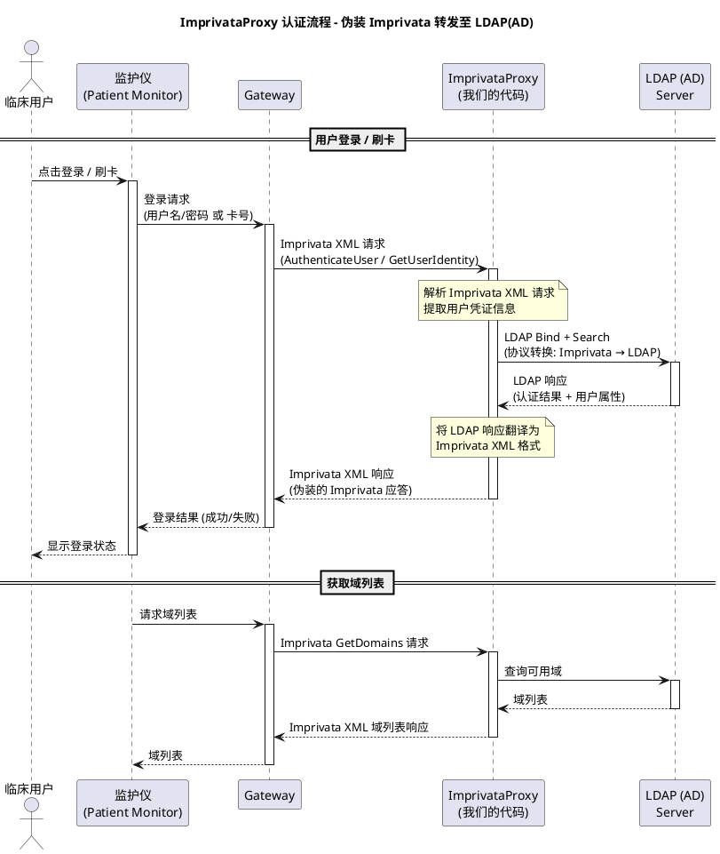
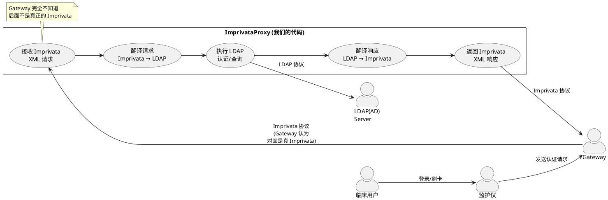

# ImprivataProxy Use Case

## 概述

监护仪通过 Gateway 发送 Imprivata 协议的认证请求，ImprivataProxy 伪装成 Imprivata 服务器接收请求，
将其转换为 LDAP(AD) 请求，再将 LDAP(AD) 响应翻译回 Imprivata 格式返回给 Gateway。

Gateway 完全不知道后面不是真正的 Imprivata 服务器。

---

## 时序图 (Sequence Diagram)

---

## 用例图 (Use Case Diagram)

---

## 关键设计点

| 层级 | 协议 | 说明 |
|------|------|------|
| 监护仪 ↔ Gateway | 内部协议 | 监护仪原有逻辑不变 |
| Gateway ↔ ImprivataProxy | Imprivata XML API | Proxy 完全模拟 Imprivata 接口 |
| ImprivataProxy ↔ LDAP(AD) | LDAP 协议 | 标准 LDAP Bind/Search 操作 |
