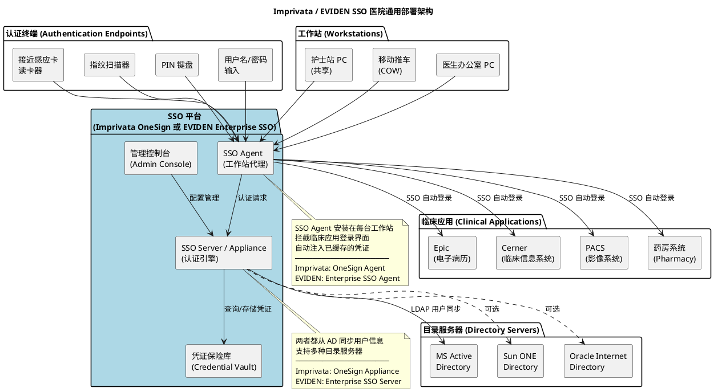
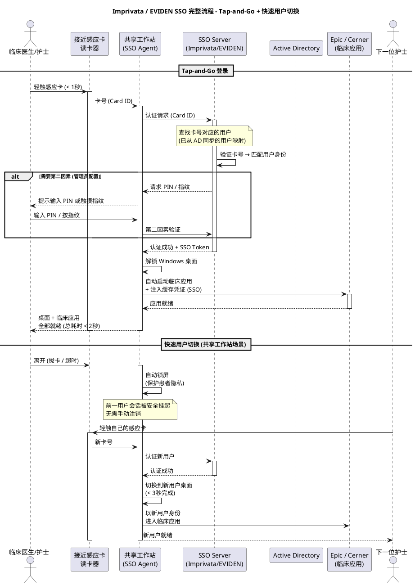
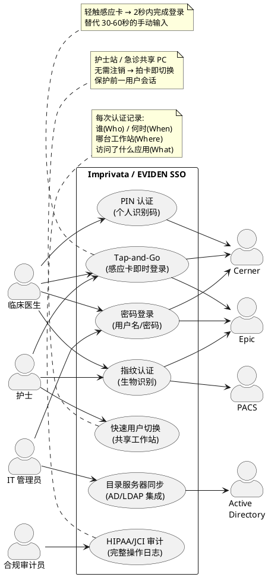
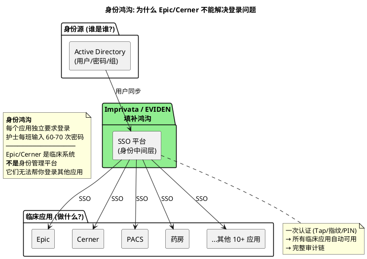

# Imprivata / EVIDEN SSO 部署 — 医院临床场景价值分析

## 概述

**Imprivata OneSign** 和 **EVIDEN Enterprise SSO**（前身为 Evidian，原属 Atos）
是医疗行业两大主流企业级单点登录(SSO)和身份管理平台。两者功能高度相似，
解决的核心问题相同：医院内临床人员每天需要在共享工作站上频繁登录多个临床系统
（Epic、Cerner、PACS 等），传统用户名/密码方式既耗时又不安全。

两者都通过感应卡(Proximity Card)、指纹、PIN 等快速认证方式，将每次登录
从 30-60 秒缩短到 2 秒以内，同时确保每次操作都可追溯到个人，满足 HIPAA/JCI 合规要求。

**核心定位**: Imprivata / EVIDEN 不是临床应用（不替代 Epic/Cerner），也不是目录服务器（不替代 AD）。
它们是连接"身份源"（AD）与"临床应用消费者"（Epic/Cerner/PACS）之间的**身份中间层**。

| 产品 | 厂商 | 前身 | 主要市场 |
|------|------|------|----------|
| **Imprivata OneSign** | Imprivata (美国) | — | 北美医疗市场领导者 |
| **EVIDEN Enterprise SSO** | EVIDEN / Atos (欧洲) | Evidian | 欧洲医疗及企业市场 |

---

## 部署架构图 (Component Diagram)

以下架构对 Imprivata OneSign 和 EVIDEN Enterprise SSO 通用——两者部署模式几乎相同：

---

## SSO 认证时序图 (Sequence Diagram)

以下流程对 Imprivata 和 EVIDEN 通用（两者工作机制相同）：

---

## 用例图 (Use Case Diagram)

---

## 目录服务器集成

两者的管理后台 (Admin Console) 都支持连接多种企业目录服务器，用于同步用户身份信息：

| 目录服务器类型 | Imprivata | EVIDEN | 说明 |
|---------------|:---------:|:------:|------|
| **MS Active Directory** | ✓ | ✓ | 最常用，医院 IT 基础设施标配 |
| **NT Domain** | ✓ | ✓ | 传统 Windows 域，兼容旧系统 |
| **NetWare NDS/eDirectory** | ✓ | ✓ | Novell 目录服务 |
| **Sun ONE Directory Server** | ✓ | ✓ | Sun/Oracle LDAP 目录 |
| **Oracle Internet Directory** | ✓ | ✓ | Oracle 企业目录服务 |
| **标准 LDAP v3** | ✓ | ✓ | 任何兼容 LDAPv3 的目录 |

**同步机制** (两者类似):
- 从目录服务器同步用户身份信息
- 感应卡号 / 指纹模板存储在本地凭证保险库
- 用户在 AD 中被禁用 → SSO 平台自动同步，感应卡立即失效

> 参考: Imprivata OneSign 管理后台 "Select Directory Server" 界面
> 支持在向导中选择目录类型 → 配置连接参数 → 设置同步规则 → 预览用户

---

## 为什么医院有 Epic/Cerner 还需要 Imprivata / EVIDEN？

**关键洞察**:
- **Epic/Cerner** 负责临床工作流（医嘱、病历、检验）— 它们是信息的**消费者**
- **Active Directory** 负责"这个人是谁"— 它是身份的**源头**
- **Imprivata / EVIDEN** 负责"如何快速、安全地证明你是谁"— 它们是身份的**桥梁**

没有 SSO 平台，每个应用各自问一遍"你是谁？"→ 护士每班反复输入密码。
有了 Imprivata / EVIDEN，证明一次身份 → 所有应用自动信任。

---

## Imprivata vs EVIDEN 对比

| 对比维度 | Imprivata OneSign | EVIDEN Enterprise SSO |
|----------|-------------------|----------------------|
| **厂商/总部** | Imprivata Inc. (美国马萨诸塞) | EVIDEN (Atos 集团, 法国) |
| **前身** | — | Evidian (2023年随 Atos 重组更名) |
| **主要市场** | 北美医疗 (市占率领先) | 欧洲医疗及企业 |
| **感应卡认证** | ✓ (Tap-and-Go) | ✓ (Badge SSO) |
| **指纹认证** | ✓ | ✓ |
| **PIN 认证** | ✓ | ✓ |
| **密码认证** | ✓ | ✓ |
| **RFID/NFC 卡** | ✓ | ✓ |
| **快速用户切换** | ✓ (Tap-out/Tap-in) | ✓ (Fast User Switching) |
| **SSO Agent** | OneSign Desktop Agent | Enterprise SSO Agent |
| **AD/LDAP 集成** | ✓ | ✓ |
| **审计日志** | ✓ | ✓ |
| **部署方式** | 物理/虚拟 Appliance | 软件服务器 |
| **Epic 集成** | 深度集成 (Epic 认证合作伙伴) | 通过 SSO Profile 支持 |
| **Cerner 集成** | ✓ | ✓ |
| **Citrix/VDI** | ✓ (Virtual Desktop Access) | ✓ (VDI SSO) |
| **合规认证** | HIPAA, EPCS, DEA | HIPAA, GDPR, HDS |
| **管理控制台** | Web-based OneSign Admin | Web-based Admin Console |

**选择建议**:
- 北美医院、需要 Epic 深度集成 → **Imprivata**
- 欧洲医院、已有 Atos/EVIDEN 生态 → **EVIDEN**
- 功能上两者几乎等价，选择更多取决于区域支持和现有 IT 生态

---

## 关键设计点

| 层级 | 功能 | 说明 |
|------|------|------|
| 硬件层 | 接近感应卡 / 指纹扫描器 / PIN 键盘 | 物理认证因子，替代键盘输入密码 |
| SSO 平台 ↔ AD | LDAP/LDAPS 用户同步 | 同步用户信息，支持多种目录服务器 |
| SSO 平台 ↔ 工作站 | SSO Agent (工作站代理) | 拦截应用登录对话框，注入缓存凭证 |
| SSO 平台 ↔ 临床应用 | SSO Profile (登录模板) | 每个应用一套自动登录配置文件 |
| 审计层 | 操作日志 | 记录每次认证的 Who/When/Where/What |
