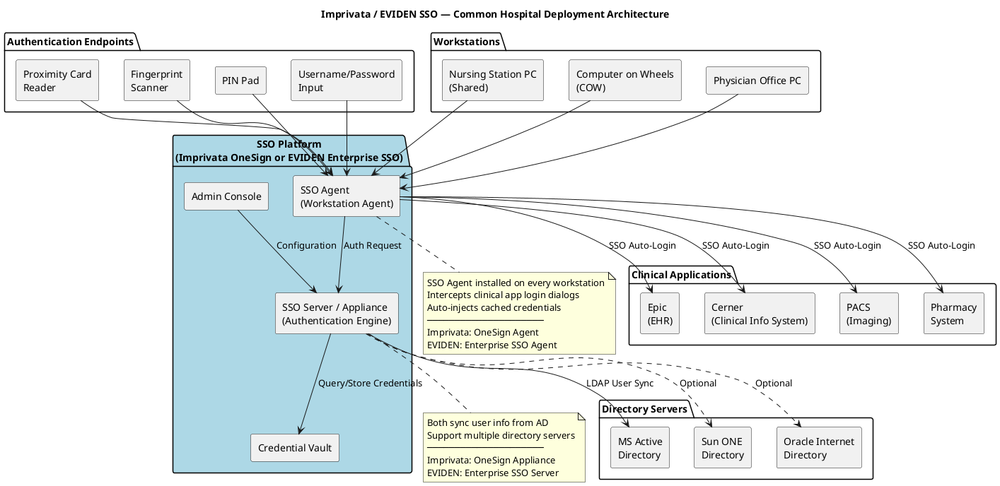
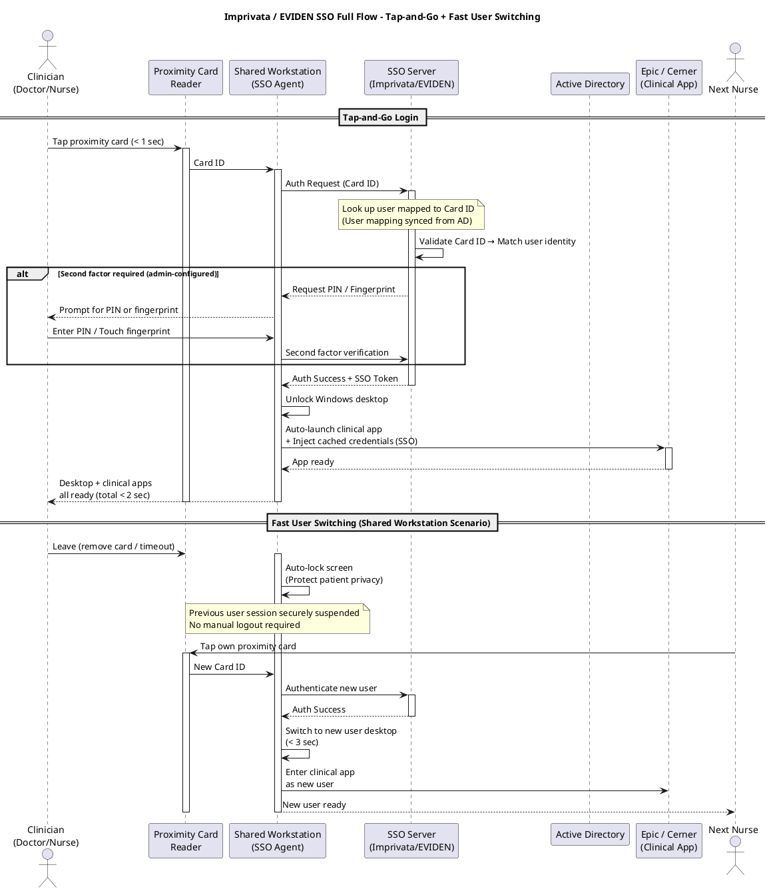
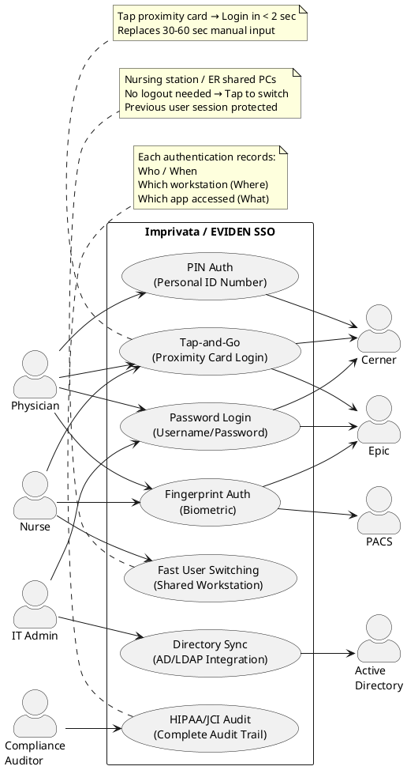
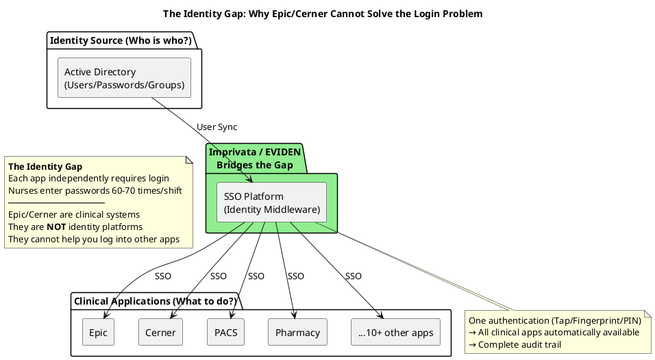

# Imprivata / EVIDEN SSO Deployment — Hospital Clinical Scenario Value Analysis

## Overview

**Imprivata OneSign** and **EVIDEN Enterprise SSO** (formerly Evidian, part of Atos)
are the two leading enterprise-grade Single Sign-On (SSO) and identity management platforms
in the healthcare industry. Both offer highly similar functionality and address the same
core problem: clinical staff in hospitals need to frequently log into multiple clinical systems
(Epic, Cerner, PACS, etc.) on shared workstations every day — traditional username/password
approaches are both time-consuming and insecure.

Both platforms use proximity cards, fingerprint, PIN and other rapid authentication methods
to reduce each login from 30-60 seconds down to under 2 seconds, while ensuring every action
is traceable to an individual, meeting HIPAA/JCI compliance requirements.

**Core Positioning**: Imprivata / EVIDEN are not clinical applications (they don't replace Epic/Cerner),
nor are they directory servers (they don't replace AD). They are the **identity middleware layer**
connecting the "identity source" (AD) with the "clinical application consumers" (Epic/Cerner/PACS).

| Product | Vendor | Predecessor | Primary Market |
|---------|--------|-------------|----------------|
| **Imprivata OneSign** | Imprivata (USA) | — | North American healthcare market leader |
| **EVIDEN Enterprise SSO** | EVIDEN / Atos (Europe) | Evidian | European healthcare and enterprise market |

---

## Deployment Architecture (Component Diagram)

The following architecture is common to both Imprivata OneSign and EVIDEN Enterprise SSO — their deployment models are nearly identical:

---

## SSO Authentication Sequence Diagram

The following flow applies to both Imprivata and EVIDEN (identical working mechanism):

---

## Use Case Diagram

---

## Directory Server Integration

Both admin consoles support connecting to multiple enterprise directory servers for user identity synchronization:

| Directory Server Type | Imprivata | EVIDEN | Description |
|-----------------------|:---------:|:------:|-------------|
| **MS Active Directory** | ✓ | ✓ | Most common, standard hospital IT infrastructure |
| **NT Domain** | ✓ | ✓ | Legacy Windows domain, backward compatibility |
| **NetWare NDS/eDirectory** | ✓ | ✓ | Novell directory service |
| **Sun ONE Directory Server** | ✓ | ✓ | Sun/Oracle LDAP directory |
| **Oracle Internet Directory** | ✓ | ✓ | Oracle enterprise directory service |
| **Standard LDAP v3** | ✓ | ✓ | Any LDAPv3-compliant directory |

**Synchronization Mechanism** (similar for both):
- Sync user identity information from directory servers
- Proximity card IDs / fingerprint templates stored in local credential vault
- User disabled in AD → SSO platform auto-syncs, proximity card immediately invalidated

> Reference: Imprivata OneSign Admin Console "Select Directory Server" interface
> Supports wizard-based directory type selection → Connection parameters → Sync rules → Preview users

---

## Why Do Hospitals With Epic/Cerner Still Need Imprivata / EVIDEN?

**Key Insights**:
- **Epic/Cerner** handle clinical workflows (orders, records, labs) — they are information **consumers**
- **Active Directory** handles "who is this person" — it is the identity **source**
- **Imprivata / EVIDEN** handle "how to quickly and securely prove who you are" — they are the identity **bridge**

Without an SSO platform, each app asks "who are you?" independently → nurses repeatedly enter passwords every shift.
With Imprivata / EVIDEN, prove identity once → all apps automatically trust you.

---

## Imprivata vs EVIDEN Comparison

| Dimension | Imprivata OneSign | EVIDEN Enterprise SSO |
|-----------|-------------------|----------------------|
| **Vendor / HQ** | Imprivata Inc. (Massachusetts, USA) | EVIDEN (Atos Group, France) |
| **Predecessor** | — | Evidian (renamed 2023 with Atos restructuring) |
| **Primary Market** | North American healthcare (market leader) | European healthcare and enterprise |
| **Proximity Card Auth** | ✓ (Tap-and-Go) | ✓ (Badge SSO) |
| **Fingerprint Auth** | ✓ | ✓ |
| **PIN Auth** | ✓ | ✓ |
| **Password Auth** | ✓ | ✓ |
| **RFID/NFC Cards** | ✓ | ✓ |
| **Fast User Switching** | ✓ (Tap-out/Tap-in) | ✓ (Fast User Switching) |
| **SSO Agent** | OneSign Desktop Agent | Enterprise SSO Agent |
| **AD/LDAP Integration** | ✓ | ✓ |
| **Audit Logging** | ✓ | ✓ |
| **Deployment Model** | Physical/Virtual Appliance | Software Server |
| **Epic Integration** | Deep integration (Epic certified partner) | Via SSO Profile |
| **Cerner Integration** | ✓ | ✓ |
| **Citrix/VDI** | ✓ (Virtual Desktop Access) | ✓ (VDI SSO) |
| **Compliance Certs** | HIPAA, EPCS, DEA | HIPAA, GDPR, HDS |
| **Admin Console** | Web-based OneSign Admin | Web-based Admin Console |

**Selection Guidance**:
- North American hospitals, need deep Epic integration → **Imprivata**
- European hospitals, existing Atos/EVIDEN ecosystem → **EVIDEN**
- Functionally nearly equivalent — choice depends more on regional support and existing IT ecosystem

---

## Key Design Points

| Layer | Function | Description |
|-------|----------|-------------|
| Hardware | Proximity Card / Fingerprint Scanner / PIN Pad | Physical authentication factors, replacing keyboard password entry |
| SSO Platform ↔ AD | LDAP/LDAPS User Sync | Sync user information, supports multiple directory servers |
| SSO Platform ↔ Workstation | SSO Agent (Workstation Agent) | Intercepts app login dialogs, injects cached credentials |
| SSO Platform ↔ Clinical Apps | SSO Profile (Login Template) | Per-application auto-login configuration |
| Audit Layer | Operation Logs | Records Who/When/Where/What for every authentication |
